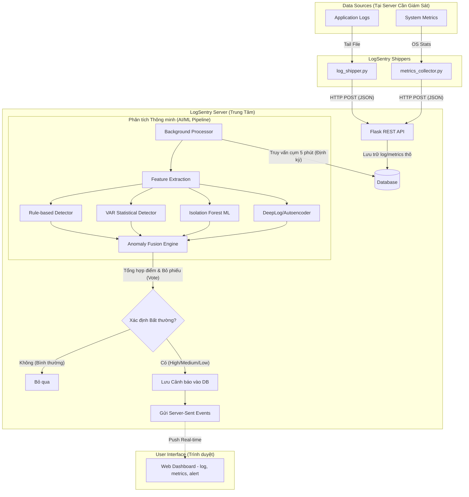

# LogSentry AI - PoC V2

LogSentry AI là một hệ thống phát hiện bất thường (Anomaly Detection) tự động cho hệ thống DevOps. Hệ thống kết hợp nhiều phương pháp phát hiện (Luật, Thống kê, Machine Learning và Deep Learning) để theo dõi các luồng log và metrics hệ thống, từ đó cảnh báo thời gian thực về các dấu hiệu lỗi hoặc bất thường tiềm ẩn.

## 1. Kiến trúc hệ thống (Architecture)

Hệ thống được thiết kế theo kiến trúc module hóa với các thành phần chính như sau:

*   **Shippers (Data Ingestion):** Thu thập logs (`log_shipper.py`) và metrics (`metrics_collector.py`) từ các server/ứng dụng và gửi về API của LogSentry theo thời gian thực (Real-time).
*   **Web API & Dashboard (Flask):** 
    *   API Server: Tiếp nhận dữ liệu, xác thực, và cung cấp Server-Sent Events (SSE) để stream trạng thái về giao diện.
    *   Dashboard: Giao diện người dùng theo dõi biểu đồ logs, metrics, alerts thời gian thực. Cung cấp tính năng quản lý, phân quyền và theo dõi các Alert (cảnh báo).
*   **Background Worker (`processor.py`):** Xử lý ngầm, gom nhóm dữ liệu theo từng cửa sổ thời gian (vd: 5 phút), tiến hành quá trình Feature Extraction và chạy Anomaly Detection.
*   **Detection Engine (Mô hình phát hiện):** Chứa nhiều detector chạy song song với nhau.
*   **Fusion Engine (`fusion.py`):** Tổng hợp kết quả từ các detector riêng lẻ để ra cấu phần "Cảnh báo cuối cùng" một cách chính xác nhất và giảm thiểu cảnh báo giả (False Positives).

## 2. Nguyên lý hoạt động & Logic xử lý

Hệ thống hoạt động theo hướng **Cửa sổ thời gian (Time-window based)**. Dữ liệu (Logs & Metrics) sẽ được thu thập liên tục nhưng được tổng hợp và đánh giá cứ sau mỗi khoảng thời gian định trước (mặc định: 5 phút).

### Quá trình phân tích một Window (Cửa sổ thời gian)

1.  **Feature Extraction (Trích xuất đặc trưng):**
    *   Hệ thống phân tích các log xuất hiện trong cửa sổ hiện tại để đếm: `error_count`, `warn_count`, `info_count`, tổng logs, và tỉ lệ lỗi (`error_rate`).
    *   Tổng hợp lấy trung bình các metrics hệ thống trong cùng thời gian: `cpu_avg`, `mem_avg`, `disk_io_avg`, `network_in`, `network_out`.
    *   => Sinh ra một bộ Vector Đặc Trưng cho 5 phút này.

2.  **Detection (Core Models):** Trải qua 4 detectors độc lập:
    *   **Rule-based Detector (~20% trọng số):** Đánh giá các tín hiệu hệ thống vượt hoặc chạm ngưỡng tĩnh tự định nghĩa (vd: CPU > 90% hay Tỉ lệ lỗi tăng đột biến).
    *   **VAR Statistical Detector (~25% trọng số):** Sử dụng mô hình thống kê Vector Autoregression nhìn vào lịch sử chuỗi thời gian gần nhất để xem window hiện tại có lệch so với thống kê chuỗi thời gian không.
    *   **Isolation Forest (~30% trọng số):** Mô hình Machine Learning chuyên biệt hóa cho việc tìm kiếm điểm dữ liệu ngoại lai dựa trên vector đặc trưng đa chiều (cả log lẫn metrics).
    *   **DeepLog/Autoencoder (~25% trọng số):** Mô hình Deep Learning tập trung vào học cấu trúc/chuỗi (sequence) của logs hoặc pattern bất định để tìm ra quy luật lỗi bị nấp sâu.

3.  **Anomaly Fusion (Đồng thuận và ra quyết định):**
    *   **Voting:** Tính xem có bao nhiêu detector báo "CÓ" lỗi. Nếu có >= 2 detector đồng thuận, hoặc điểm bất thường tổng quát đủ cao (đủ trọng số), hệ thống xác định đây là một Anomaly (bất thường).
    *   **Severity Scoring:** Gán cảnh báo mức độ **High** (Cao, score >= 0.7), **Medium** (Vừa, score >= 0.4), hoặc **Low** (Thấp) tuỳ theo tỉ lệ phần trăm khẳng định lỗi của từng hệ thống detector đóng góp.

4.  **Alerting & WebSocket:**
    *   Khi có bất thường (Anomaly = 1), sinh ra `Alert` lưu vào Database.
    *   Phát sự kiện (SSE event) về trình duyệt của người quản trị đang mở Dashboard ngay lập tức với thông tin cảnh báo: (vd: `High CPU: 90% | Errors: 50`).

## 3. Workflow tổng thể (System Workflow)

Sơ đồ dưới đây mô tả luồng di chuyển của dữ liệu từ các máy chủ/ứng dụng cho đến khi phát sinh cảnh báo trên màn hình của quản trị viên:



## 4. Hai phương thức vận hành hệ thống

Dự án này hỗ trợ thực thi trên 2 modes khác nhau:

### Mode 1: Batch / Pipeline tự động (Cho thử nghiệm / Training)
File: `pipeline.py`
Toàn bộ quy trình sẽ chạy tuần tự từ tạo data giả sang model để học và đánh giá mô hình.
*   **Step 1:** Generate synthetic logs và metrics mô phỏng.
*   **Step 2:** Trích xuất features thô thành `features.csv`.
*   **Step 3:** Chạy nhận diện qua 4 Detector để lưu lại `results` và export model parameters đã train (Isolation Forest/DeepLog).
*   **Step 4 & 5:** Tiến hành chạy Fusion và sinh ra bảng báo cáo `alerts.csv` cùng log màn hình độ chính xác của mô hình (Precision, Recall, F1-Score).

### Mode 2: Tham gia Real-time Server (Sản xuất thực tế)
File: `run.py`, `app/workers/*`, `shippers/*`

Là kiến trúc Client-Server với API giám sát 24/7.
*   **Server (`run.py`):** Khởi chạy Web Dashboard, REST API và ngầm kích hoạt `Background Worker`.
*   **Shippers:** Tại server của ứng dụng (nơi cần giám sát), cài đoạn script nhỏ dưới máy tính cục bộ: 
    *   `python shippers/log_shipper.py --log-file application.log --service api --api-url http://<logsentry-server>` để theo dõi stream file log đẩy lên server HTTP API.
*   **Worker:** Lặng lẽ chia logs ra các khoảng 5 phút và tự gọi model Detection. Chuyển thông báo realtime về giao diện nếu phát hiện điều dị thường.

## 5. Hướng dẫn sử dụng & Cài đặt

**1. Cài đặt thư viện:**
Môi trường Python (Khuyến cáo 3.8+):
```bash
pip install -r requirements.txt
pip install -r requirements_flask.txt
```

**2. Khởi tạo Database và chạy Web App:**
```bash
python run.py
```
*Tài khoản mặc định: `admin` / `admin123`*
*Giao diện mở tại: `http://localhost:5000`*

**3. Chạy môi phỏng/Training Model (Pipeline Mode):**
```bash
python pipeline.py
```
*(Nếu muốn skip tạo lại data và dùng đồ cũ, gắn cờ `--no-generate`)*

**4. Khởi động Client gửi Log Thực Tế:**
Mở một Terminal khác:
```bash
python shippers/log_shipper.py --log-file [PATH_TO_YOUR_APP_LOG_FILE] --api-url http://localhost:5000 --service my-app
```
(Dữ liệu từ lúc này sẽ đi vào LogSentry qua API và xuất hiện trên Dashboard/Detection Engine).
